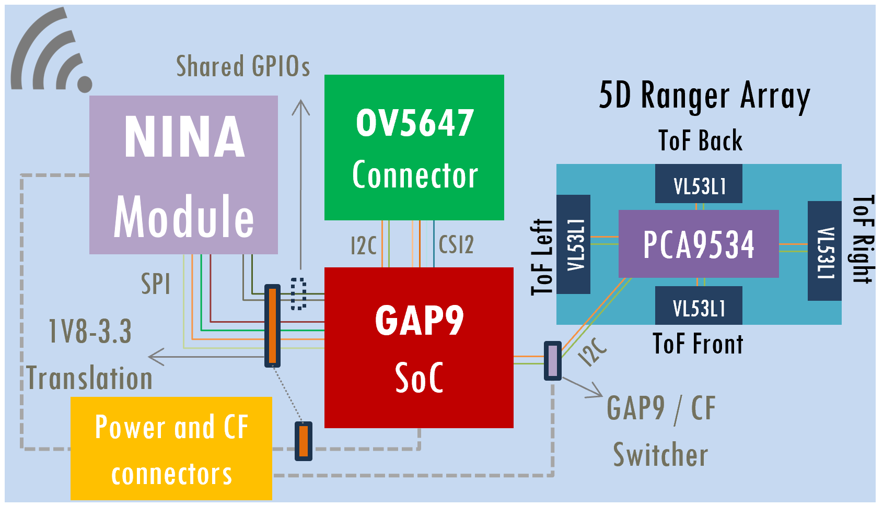

# GAP9Shield: An AI-Capable Ultra-Low Power Module for Nano-Drones  

## Introduction  
The **GAP9Shield** is a state-of-the-art hardware module designed to enhance the performance of nano-drones, enabling advanced vision-based and ranging applications. Powered by the **GAP9 System-on-Chip (SoC)**, this platform delivers unparalleled AI processing capabilities and energy efficiency. With its compact design and cutting-edge features, GAP9Shield revolutionizes the potential of nano-drones, particularly for indoor environments and close-proximity interactions with humans.  

---

## Features and Specifications  

### Core Processor: GAP9 SoC  
- **Architecture**: 9-core RISC-V cluster with AI acceleration (NE16).  
- **Performance**: 15.6 GOPs for DSP, 32.2 GMACs for ML tasks.  
- **Energy Efficiency**: 330 µW/GOP.  
- **Dynamic Scaling**: Frequency up to 370 MHz, sleep power as low as 45 µW.  
- **Memory**:  
  - 1.6 MB L2 RAM and 2 MB embedded non-volatile memory.  
  - Additional 256 Mbit PSRAM and 512 Mbit Flash.  

### Camera: OV5647 Sensor  
- **Resolution**: 5 MP, supporting QSXGA to QVGA formats.  
- **Frame Rates**: Up to 120 fps (QVGA).  
- **Interface**: CSI2 single-line connectivity.  

### Connectivity: NINA-W102 Wi-Fi/BLE Module  
- **Processor**: ESP32 dual-core MCU.  
- **Wireless Capability**: 2.4 GHz Wi-Fi and Bluetooth.  
- **Throughput**: Up to 12 Mbps (UDP) with low power consumption.  

### Ranging System: 5D VL53L1 Array  
- **Directionality**: Covers right, left, front, back, and upward directions.  
- **Range**: Up to 400 cm with a sampling rate of 60 Hz.  

### Physical Characteristics  
- **Dimensions**: 50 mm x 27 mm (6-layer PCB).  
- **Weight**: Approx. 6 grams.  

---

## Key Advantages  

### Performance  
- 20% higher frame rate for RGB images compared to conventional AI-decks.  
- Optimized for AI workloads like YOLO object detection, MCL localization, and SLAM.  

### Energy Efficiency  
- Operates below 100 mW for most tasks.  
- Designed for extended flight durations with lightweight, power-efficient components.  

### Versatility  
- Compatible with high-definition cameras via MIPI CSI2.  
- Integrated Wi-Fi and BLE modules for seamless data streaming and communication.  

### Compact and Lightweight  
- 15% lighter and 30% smaller than comparable setups.  

---

## Applications  
The GAP9Shield is ideal for:  
- Obstacle avoidance in confined spaces.  
- Real-time object detection and mapping.  
- Greenhouse farming and industrial inspections.  
- Precise image recognition and navigation in cluttered environments.  

---

## Repository Organization
1. Hardware: Contains the hardware files for the shield.
1.1 gap9_deck_v2: Contains the design files (Altium) for the shield.
1.2 ToF-FrontBack: Contains the design files (Altium) for the ToF PCBs (front and back). These need to be mounted first and then soldered to the main PCB.
1.3 ToF-LeftRight: Contains the design files (Altium) for the ToF PCBs (Right and left). These need to be mounted first and then soldered to the main PCB.

2. Firmware: will contain firmware files (future release).

3. Documents: Contains the repository documentation.
3.1 Schematics: Main PCB and accesory PCB schematics in PDF format.
3.2 Pictures: Images/3D models of the shield.
3.3 Diagrams: GAP9shield diagrams.

---

## Acknowledges

If you use the **GAP9shield** in an academic or industrial context, please cite the following publication:

~~~~
@InProceedings{muller2024gap9shield,
author="M{\"u}ller, Hanna
and Kartsch, Victor
and Benini, Luca",
title="GAP9Shield: A 150GOPS AI-Capable Ultra-low Power Module for Vision and Ranging Applications on Nano-drones",
booktitle="European Robotics Forum 2024",
year="2024",
publisher="Springer Nature Switzerland",
address="Cham",
pages="292--297",
isbn="978-3-031-76424-0"
}
~~~~

# License

This project is open source. 

The files within the following folder (and subfolders) are released under Solderpad v0.51 (`SHL-0.51`) (see [LICENSE](LICENSE.txt)):

- `Hardware/`

The files within the following folder (and subfolders) are released under Creative Commons Attribution 4.0 International
License (`CC-BY-4.0`) (see [Documents/LICENSE](Documents/LICENSE)):

- `Documents/`